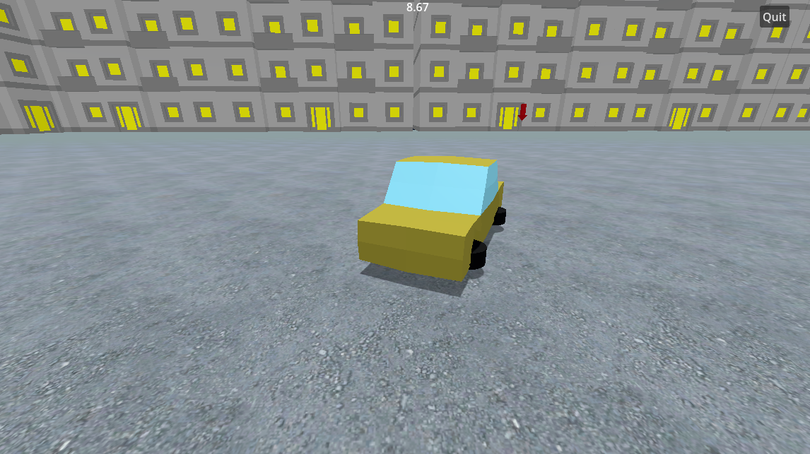

# Driving demo

## Overview
Driving-demo is a simulation game developed using the Godot Engine. The game is built with Godot 4.2 and C#.
## Installation
Clone the repository or download the source code.
Open the project in Godot Engine.
Ensure the Godot C# support is properly set up by following the official Godot documentation.
Build the project from the Godot editor or using the command line with dotnet build.
## Running the Game
In the Godot editor, press the 'Run Project' button to start the game.
Alternatively, you can export the project to your preferred platform and run the executable.
## Controls
- Move Forward: W
- Move Backward: S
- Turn Left: A
- Turn Right: D
- Brake/Drift: Spacebar

